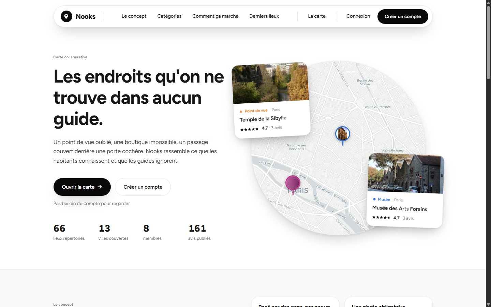
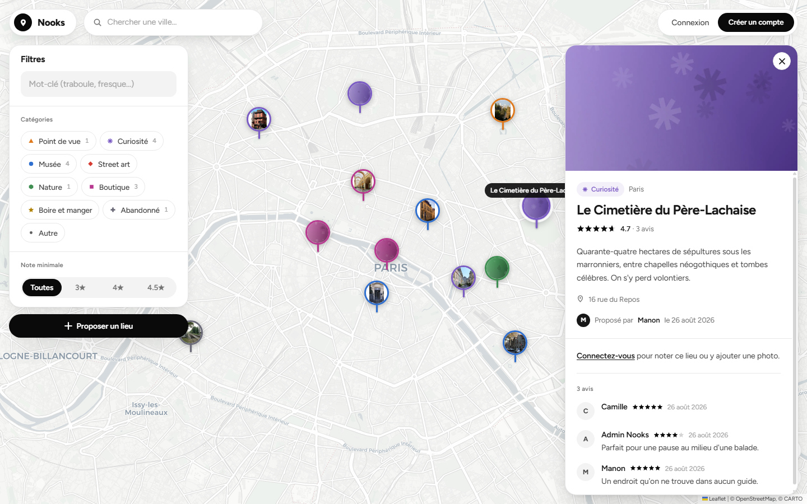
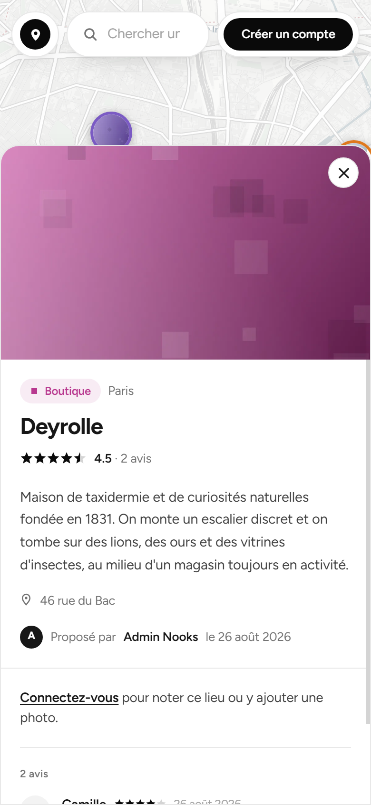

# Nooks

Une carte collaborative de lieux insolites : points de vue oubliés, boutiques atypiques, cabinets de curiosités, passages couverts, friches réhabilitées. On cherche une ville, on filtre par catégorie et par note, et on tombe sur ce que les guides ne mentionnent pas.

Preuve de concept : le fond de carte est rempli par un jeu de données de départ, et n'importe quel membre inscrit peut proposer un lieu, le noter, y ajouter des photos et le mettre en favori.



<p align="center">
  
  
</p>

## Stack

| Couche | Choix | Pourquoi |
|---|---|---|
| API | ASP.NET Core 10, Minimal API | Endpoints groupés par domaine, ProblemDetails, OpenAPI + Scalar |
| Persistance | EF Core 10 + Npgsql + NetTopologySuite | Les entités portent un vrai `Point` géographique |
| Base | PostgreSQL 17 + PostGIS | Index GiST : la recherche « lieux dans le rectangle visible » est une requête spatiale, pas un filtre en mémoire |
| Auth | ASP.NET Core Identity + JWT HS256 | Identity pour le stockage et le hachage, jetons portables vers une future app mobile |
| Front | Angular 21 (standalone, signals, zoneless) + Tailwind 4 | Un seul composant touche à Leaflet, le reste ne connaît que des lieux |
| Carte | Leaflet + markercluster, fonds CARTO et OpenStreetMap | Marqueur = photo du lieu cerclée de la couleur de sa catégorie ; regroupement au dézoom ; fond de carte au choix |
| Géocodage | Nominatim, en proxy côté serveur | Cache 24 h et limitation à 1 req/s, comme l'exige leur politique d'usage |
| Images | SkiaSharp | Réencodage en WebP + vignette, licence MIT |
| Tests | xUnit, WebApplicationFactory, Testcontainers | Les tests d'intégration tournent sur un vrai PostGIS jetable |

## Démarrer

Prérequis : .NET SDK 10, Node 20.19+ (ou 22.12+, ou 24+), Docker.

```bash
docker compose up -d                                                   # PostGIS sur le port 5433
dotnet ef database update -p src/Nooks.Infrastructure -s src/Nooks.Api
dotnet run --project src/Nooks.Api                                     # http://localhost:5001
cd client && npm install && npm start                                  # http://localhost:4200
```

Au premier démarrage en `Development`, la base est migrée puis remplie : 66 lieux répartis sur treize villes, huit comptes de démonstration et plus de 160 avis.

Les commentaires du jeu de départ sont volontairement génériques, et chaque lieu reçoit une illustration abstraite générée à la volée. Ce ne sont volontairement pas des photographies : il n'existe pas de vraie photo libre de droits pour ces lieux, et une fausse photo tromperait le lecteur. Les lieux proposés par un membre portent, eux, ses vraies photos.

| Compte | Mot de passe | Rôle |
|---|---|---|
| `admin@nooks.local` | `Nooks!2026` | Admin + Membre |
| `camille@nooks.local`, `hugo@nooks.local`, `lea@nooks.local`, `karim@nooks.local`, `sofia@nooks.local`, `thomas@nooks.local`, `manon@nooks.local` | `Nooks!2026` | Membre |

La documentation de l'API est sur <http://localhost:5001/scalar> en développement.

## Architecture

```
src/
  Nooks.Core/             entités, règles métier, DTOs, interfaces  (ne référence aucune techno)
  Nooks.Infrastructure/   EF Core, migrations, Identity, Nominatim, stockage des photos
  Nooks.Api/              endpoints, authentification, seed
tests/
  Nooks.Core.Tests/       unitaires sur le domaine
  Nooks.Api.Tests/        intégration bout en bout sur un PostGIS Testcontainers
client/                   Angular
```

`Nooks.Core` ne connaît ni EF Core ni ASP.NET : les interfaces de dépôt y sont déclarées, leurs implémentations vivent dans `Nooks.Infrastructure`. Les règles métier (une note par membre et par lieu, moyenne recalculée, bornes des coordonnées) sont dans l'agrégat `Place`, pas dans les endpoints.

### Le point intéressant : la recherche spatiale

La carte envoie le rectangle qu'elle affiche, l'API le traduit en polygone PostGIS :

```csharp
var polygon = query.Bounds.ToPolygon();
var places = context.Places
    .Where(p => p.Status == PlaceStatus.Approved)
    .Where(p => p.Location.Intersects(polygon));   // ST_Intersects, servi par l'index GiST
```

Le rectangle est validé côté serveur (bornes, orientation, surface maximale de 100 degrés carrés) pour qu'une requête trop large ne ramène jamais la base entière.

## Photos et marqueurs

Une photo au moins est exigée à la création d'un lieu : c'est elle qui devient le marqueur sur la carte. La création passe donc par un seul appel `multipart/form-data` qui transporte le lieu et ses images, plutôt qu'une création suivie d'un envoi de photos, ce qui laisserait un lieu sans marqueur si la seconde requête échouait.

Les images sont réencodées en WebP (1600 px maximum) avec une vignette de 400 px, et le type réel du fichier est vérifié sur ses premiers octets, pas sur l'en-tête `Content-Type` qui n'est que déclaratif. Les lieux sans photo restent gérés : leur marqueur retombe sur le pictogramme de la catégorie, ce qui évite qu'un lieu devienne invisible si la modération retire une image.

## Avis

Un membre laisse **un seul avis par lieu** : une note de 1 à 5 étoiles, avec un commentaire facultatif. Il peut le retoucher autant qu'il veut ; l'avis porte alors la mention « modifié ». Renvoyer exactement le même contenu ne compte pas comme une modification, pour ne pas afficher la mention à tort après un double clic.

La moyenne du lieu est dénormalisée sur `Place` et recalculée dans l'agrégat à chaque avis, jamais depuis un endpoint.

## Doublons

Le problème d'une carte ouverte à tous, c'est qu'un même lieu finit posté cinq fois. Deux règles, volontairement simples à expliquer :

- même nom (une fois normalisé : sans accents, sans ponctuation, sans articles ni élisions) à moins de **500 m** ;
- même catégorie à moins de **75 m**.

Le formulaire interroge `GET /api/places/similar` dès qu'un nom et un point sont posés, et affiche les lieux ressemblants avec une invitation à les noter ou les compléter plutôt qu'à en créer un second. `POST /api/places` refait le contrôle et répond `409` si l'auteur n'a pas explicitement confirmé : l'avertissement ne se contourne pas en appelant l'API directement.

Si l'auteur maintient sa proposition, le lieu est créé mais marqué `SuspectedDuplicate` et placé en attente de modération, quel que soit le réglage `AutoApprove`. La file de modération le signale par un badge.

## Affichage à grande échelle

Les marqueurs proches se regroupent en pastilles chiffrées dès qu'on dézoome, et les rechargements sont amortis pour ne garder que la dernière position de la carte. Au-delà de 100 degrés carrés de zone visible, le front n'interroge même pas l'API et invite à zoomer : c'est la même limite que celle appliquée côté serveur.

## Modération

En preuve de concept, un lieu proposé est publié immédiatement. Le modèle de données porte déjà le statut `Pending` / `Approved` / `Rejected` : passer en validation manuelle est un réglage, pas une migration.

```json
"Moderation": { "AutoApprove": false }
```

Les lieux partent alors en file d'attente, invisibles sur la carte publique, jusqu'à ce qu'un admin les traite depuis `/moderation`.

## Pages

| Route | Contenu |
|---|---|
| `/` | Accueil : vignette de carte et lieux mis en avant, chiffres réels, concept, catégories, derniers lieux |
| `/carte` | La carte, ses filtres et la proposition de lieux. Accepte `?categorie=` et `?lieu=` |
| `/profil`, `/membres/:id` | Profil : présentation, avatar, lieux proposés, avis, favoris |
| `/admin` | File d'attente, lieux publiés, modération des avis, liste des membres |

La carte s'adapte au téléphone : les filtres et la fiche d'un lieu deviennent des feuilles qui montent du bas, et la navigation passe derrière un menu.

## Comptes et profils

Chaque membre a une page : photo, présentation, compteurs (lieux proposés, avis publiés, favoris) et le détail de ses contributions. Les favoris ne sont visibles que par leur propriétaire, le compteur reste public.

## Photos du jeu de départ

Le seed va chercher l'illustration de chaque lieu sur son **article Wikipédia**, pas par une recherche libre sur Commons : l'image principale d'un article porte sur le sujet, là où une recherche par mots-clés ramène régulièrement une photo sans rapport. L'auteur et la licence sont enregistrés avec la photo et affichés sur la fiche. Les lieux sans article utilisable reçoivent une illustration abstraite générée, clairement pas une photographie.

Sur les 66 lieux du jeu de départ, 46 ont une vraie photo. `Seed:FetchPhotos` à `false` coupe l'accès réseau (c'est le réglage des tests).

## Modération des avis

Un avis retiré disparaît de la fiche et cesse de compter dans la moyenne, mais reste en base avec son auteur et sa date : la modération le retrouve dans l'onglet dédié et peut le restaurer. La suppression définitive reste disponible pour le spam. L'auteur d'un avis retiré ne peut plus le modifier.

## Performances

- Les marqueurs proches se regroupent en pastilles chiffrées au dézoom.
- Les rechargements de carte sont amortis : un déplacement enchaîne plusieurs événements, un seul appel part.
- Au-delà de 100 degrés carrés visibles, le front n'interroge plus l'API et invite à zoomer.
- Les fichiers envoyés portent un nom unique : ils sont servis avec un cache d'un an, ce qui supprime une revalidation par vignette à chaque déplacement.
- Les réponses JSON comme les fichiers du site sont compressées par l'API.
- Les requêtes de lecture sont sans suivi EF, et tous les composants Angular sont en `OnPush` sur une application sans zone.

## Mise en production

Le site tient dans **une image Docker et une base**. L'API sert aussi le site Angular, construit dans la même image et déposé dans son `wwwroot` : une seule origine, donc pas de second hébergeur, pas de CORS et pas d'URL à faire correspondre entre le front et l'API.

Le déploiement en ligne est décrit dans [docs/DEPLOIEMENT.md](docs/DEPLOIEMENT.md). Il se résume à un fichier, [`render.yaml`](render.yaml), que l'hébergeur lit pour construire l'image, créer la base et les relier lui-même.

La même pile tourne en local, ce qui permet de répéter un déploiement avant de le faire :

```bash
cp .env.example .env      # puis remplir le mot de passe et la clé de signature
docker compose -f docker-compose.prod.yml up -d --build
```

Points à connaître :

- **Les migrations s'appliquent à chaque démarrage**, y compris en production : le conteneur doit pouvoir partir d'une base vide.
- **Les photos sont rangées dans la base**, pas sur un disque. C'est ce qui permet de déployer sans volume à monter, et elles survivent aux redéploiements sans stockage supplémentaire. Elles sont resservies par `/uploads/...` avec un cache d'un an.
- **Le jeu de démonstration part en arrière-plan** une fois l'application en écoute. Son premier passage télécharge les photos sur Wikipédia et dure plusieurs minutes : l'attendre avant d'ouvrir le port ferait passer le démarrage pour un échec. Il dépend de `Seed:Demo`, à passer à `false` pour un vrai site.
- **`ConnectionStrings__Default` accepte aussi une URL** `postgres://...`, le format que fournissent les hébergeurs. Elle est traduite au démarrage, Npgsql ne la comprenant pas telle quelle. À défaut, `DATABASE_URL` est lue.
- **`Moderation:AutoApprove` vaut `false`** en production : chaque lieu proposé passe par la file de modération.
- **La clé de signature JWT n'a pas de valeur par défaut** en production : le démarrage échoue si elle manque, plutôt que de tourner avec une clé connue de tous.

L'intégration continue (`.github/workflows/ci.yml`) construit l'API et le front, lance les 68 tests, puis vérifie que l'image Docker se construit. Les tests d'intégration démarrent leur propre PostGIS via Testcontainers, ce que le runner GitHub permet sans configuration.

## Tests

```bash
dotnet test
```

68 tests : le domaine en unitaire (recalcul de moyenne, bornes des notes et des coordonnées, analyse du rectangle, normalisation des noms et règles de doublon) et les endpoints en intégration sur une base PostGIS démarrée par Testcontainers, ce qui couvre les requêtes spatiales réelles. Docker doit tourner.

## Limites connues

- **Jeton JWT stocké côté navigateur**, donc exposé au XSS. Acceptable pour un POC, à remplacer par un cookie `HttpOnly` et un jeton de rafraîchissement avant toute mise en ligne.
- **Photos écrites sur le disque local**, sans réplication ni CDN.
- **Fonds de carte CARTO et OpenStreetMap**, dont les politiques d'usage ne couvrent pas un vrai trafic. Un fournisseur de tuiles sous contrat serait nécessaire en production.
- **Coordonnées du jeu de départ approximatives** à quelques dizaines de mètres : elles servent la démonstration, pas la navigation.
- Le regroupement de marqueurs est calculé dans le navigateur : au-delà de quelques milliers de lieux dans une même zone, il faudra agréger côté serveur.
- La détection de doublons compare des noms, pas des lieux : deux noms très différents pour le même endroit passeront à travers.

## Pistes suivantes

- « Surprends-moi » : un lieu au hasard à moins de X km, une requête PostGIS d'une ligne.
- Itinéraires : enchaîner plusieurs lieux d'une ville en une balade.
- Favoris avant un voyage, puis marquage « visité ».
- Mise en avant de lieux partenaires.
- Signalement d'un lieu disparu ou inexact, qui alimente la même file de modération.
- PWA et géolocalisation, avant une vraie application mobile.
